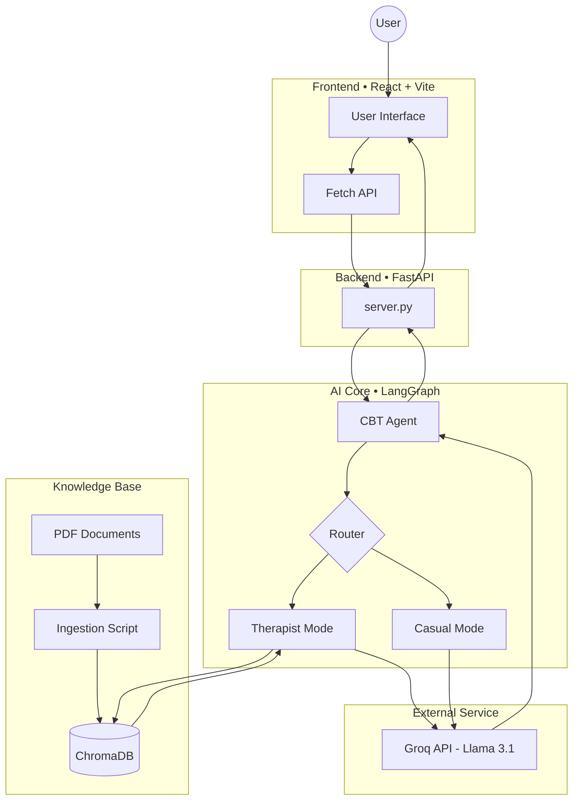

# Mentis RAG Model - AI Mental Health Assistant

Mentis is a Retrieval-Augmented Generation (RAG) powered mental health assistant designed to provide Cognitive Behavioral Therapy (CBT) based support. It combines a modern React frontend with a powerful LangGraph agent backend to deliver personalized, source-cited advice.

## 🧠 System Architecture



## 🚀 Features

- **Dual-Mode Intelligence**:
  - **Therapist Mode**: Detects mental health topics (anxiety, sleep, depression) and consults a curated database of CBT manuals to provide professional, evidence-based advice.
  - **Casual Mode**: Engages in natural, warm conversation for general topics without unnecessary database lookups.
- **RAG Architecture**: Retrieves context from indexed PDF documents (e.g., CBT manuals, self-care guides) to ground answers in reality.
- **Source Citations**: Every piece of therapeutic advice cites the specific document source.
- **Fast Inference**: Powered by **Groq** (Llama-3.1-8b-instant) for near-instant responses.
- **Modern UI**: A responsive, dark-themed interface built with **React**, **TailwindCSS**, and **Lucide Icons**.

## 🛠️ Tech Stack

- **Frontend**: React 19, Vite, TailwindCSS
- **Backend**: FastAPI, Uvicorn
- **AI/ML**: LangChain, LangGraph, ChromaDB (Vector Store), Sentence Transformers
- **LLM Provider**: Groq

## 📂 Project Structure

```bash
root/
├── Back/               # FastAPI Backend
│   └── server.py       # API Endpoint & Agent Connection
├── Mentis/             # React Frontend
│   ├── src/            # UI Source Code
│   └── package.json    # Frontend Dependencies
└── Model/              # AI Logic & Data
    ├── agent.py        # LangGraph Agent Definition
    ├── ingest_pdf.ipynb # PDF Ingestion Notebook
    ├── data/           # PDF Documents Repository
    └── my_vector_db/   # ChromaDB Storage
```

## ⚡ Getting Started

### Prerequisites
- Python 3.10+
- Node.js & npm
- A Groq API Key

### 1. Backend Setup

1. Navigate to the `Model` directory and create a virtual environment (optional but recommended).
2. Install dependencies (refer to imports in `agent.py` and `server.py`).
3. Create a `.env` file in `Model/` with your API key:
   ```env
   GROQ_API_KEY=your_api_key_here
   ```
4. Run the ingestion script (if starting fresh) to populate the database:
   Run `ingest_pdf.ipynb` via Jupyter.
5. Start the Server:
   ```bash
   cd Back
   python server.py
   ```
   *Server runs on `http://localhost:8000`*

### 2. Frontend Setup

1. Navigate to the `Mentis` directory:
   ```bash
   cd Mentis/Mentis
   ```
2. Install dependencies:
   ```bash
   npm install
   ```
3. Start the Development Server:
   ```bash
   npm run dev
   ```
   *App runs on `http://localhost:5173`*

## 📝 Usage

1. Open `http://localhost:5173`.
2. Type a message like *"I'm feeling very anxious today"* or *"How can I sleep better?"*.
3. The agent will retrieve relevant CBT techniques from the knowledge base and respond.
